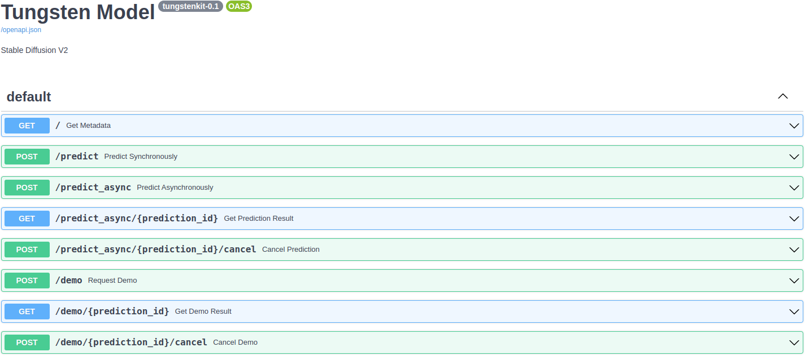

<p align="center">
  <a href="https://tungsten-ai.github.io/tungsten-docs"></a>
</p>
<p align="center">
  
</p>

---
## What is Tungsten?
Tungsten is a containerization tool and platform for easily sharing and managing ML models.

Tungsten enables to build [a versatile and standardized container for an ML model](#tungsten-model).
Without any model-specific setup, it can be run as a RESTful API server, a GUI application, a CLI application, and a serverless function, and a Python script.

Also, Tungsten provides [a centralized place to manage ML models systematically](#tungsten-platform). It supports remote execution and test automation as well as storing models.

---

## Tungsten Model
The Tungsten model is the basic unit of ML model in Tungsten. It is a Docker container and contains a standardized API and all dependencies for an ML model.

### Key Features
- **Easy to build**: [Require only a few lines of Python codes.](#build-a-tungsten-model)
- **Easy to use**: [Do not require any model-specific setup for running.](#run-it-as-a-restful-api-server)
- **Versatile**: Can be used in multiple ways:
    - [RESTful API server](#run-it-as-a-restful-api-server)
    - [GUI application](#run-it-as-a-gui-application)
    - [Serverless function](#run-it-as-a-serverless-function)
    - CLI application (comming soon)
    - Within Python scripts (comming soon)
- **Standardized**: [Communicate with JSONs through a standardized RESTful API](#run-it-as-a-restful-api-server).
- **Scalable**: Support adaptive batching and clustering with Redis and a cloud storage.

For learning more with a complete example, see the [Tungsten Model - Getting Started](https://tungsten-ai.github.io/tungsten-docs/tungsten_model/getting_started/).

---

### Take the tour
#### Build a Tungsten model
Building a Tungsten model does not require any complex configuration file for building. 

All you have to do is write a simple ``tungsten_model.py`` like below:
```python
from typing import List, Tuple

import torch
from tungstenkit import io, model


class Input(io.BaseIO):
    image: io.Image


class Output(io.BaseIO):
    score: float
    label: str


@model.config(
    gpu=True,
    python_packages=["torch", "torchvision"],
    batch_size=64,
    description="Image classification model"
)
class Model(model.TungstenModel[Input, Output]):
    def setup(self):
        self.model = torch.load("./weights.pth")

    def predict(self, inputs: List[Input]) -> List[Output]:
        input_tensor = preprocess(inputs)
        output_tensor = self.model(input_tensor)
        outputs = postprocess(output_tensor)
        return outputs
```

#### Run it as a RESTful API server

The built container can be run as a standardized RESTful API server itself.

Run the container:

```console
$ docker run -p 3000:3000 --gpus all tungsten-example:latest

INFO:     Setting up the model
INFO:     Getting inputs from the input queue
INFO:     Starting the prediction service
INFO:     Started server process [1]
INFO:     Waiting for application startup.
INFO:     Application startup complete.
INFO:     Uvicorn running on http://0.0.0.0:3000 (Press CTRL+C to quit)
```

Now you can run predictions using the server. For example,
```console
$ curl -X 'POST' 'http://localhost:3000/predict' \
  -H 'accept: application/json' \
  -H 'Content-Type: application/json' \
  -d '[{"image": "https://picsum.photos/200.jpg"}]'

{
    "status": "success",
    "outputs": [{"score": 0.5, "label": "dog"}],
    "error_message": null
}
```

Also, a Swagger documentation for the server is automatically generated.

Visit [http://localhost:3000/docs](http://localhost:3000/docs) in a browser:



#### Run it as a GUI application
You can run a GUI app in a single command:
```console
$ tungsten demo tungsten-example:latest -p 8080

INFO:     Uvicorn running on http://localhost:8080 (Press CTRL+C to quit)
```
Visiting [http://localhost:8080](http://localhost:8080) in a browser, you can run a prediction:


#### Run it as a serverless function
Push a model to [a Tungsten platform](#tungsten-platform):
```console
$ tungsten push exampleuser/exampleproject -n tungsten-example:latest

✅ Successfully pushed to 'https://server.tungsten-ai.com'
```

Then you can run predictions for the model in the Tungsten platform.

Visit [https://tungsten-ai.com](https://tungsten-ai.com) in a browser:


---

## Tungsten Platform
The Tungsten platform is where you store, run, compare, and test Tungsten models.

### Key Features
- [Hassle-free model deployment](#hassle-free-model-deployment)
- [Allow your own machines to be used to run models](#allow-your-own-machines-to-be-used-to-run-models)
- Model, test data, and test spec versioning (comming soon)
- Automatically keep evaluation scores up-to-date (comming soon)

---

### Take the tour
#### Hassle-free model deployment
The Tungsten platform supports automatic serverless deployment of models.
So, uyou don't need to spend time managing infrastructure for serving them.

You can run all uploaded models through Tungsten platform's API or web UI.

#### Allow your own machines to be used to run models
You can register Tungsten runners to a Tungsten server and make the server use your own machines for running models.

Register a runner:

```console
$ tungsten-runner register

Enter runner mode (pipeline, prediction) [prediction]: prediction
Enter URL of the tungsten server: https://server.tungsten-ai.com
Enter registration token: C6r5rp2PhfdXbJtFbBMhifgLDhagAc
Enter runner name [mydesktop]: myrunner 
Enter tags (comma separated) []: myrunnergroup
Enter GPU index to use []: 0
Runner 'mjpyeon-desktop' is registered - id: 245
Updated runner config
```

Run all registered runners:

```console
$ tungsten-runner run

Runner 0   | running  2023-04-21 16:59:14.490 | INFO     | Fetching a prediction job
                      2023-04-21 16:59:49.184 | INFO     | Job 0f7c50867417456ebd1389cfb74e489f assigned
Runner 1   | running  2023-04-21 16:59:14.490 | INFO     | Fetching a prediction job
```


## License
This project is licensed under the terms of the Apache License 2.0.
