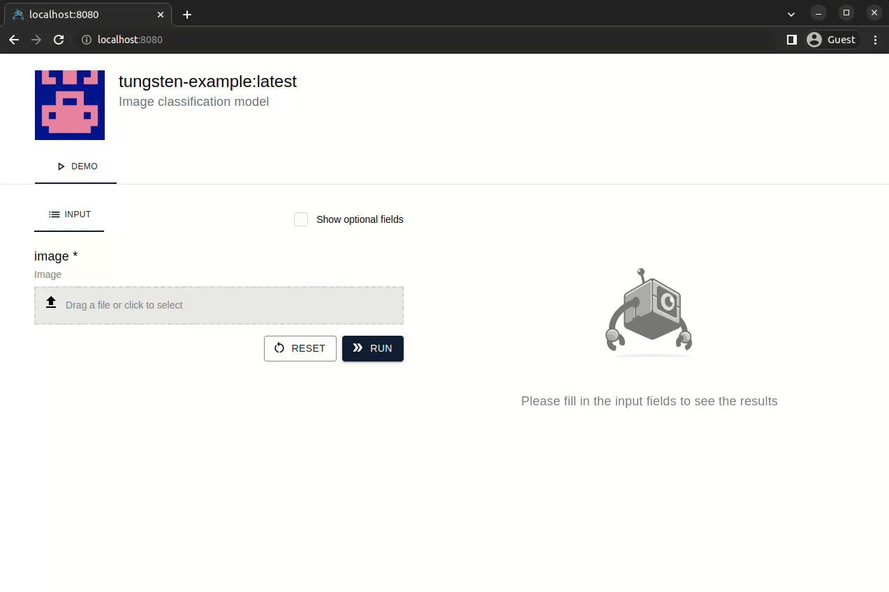
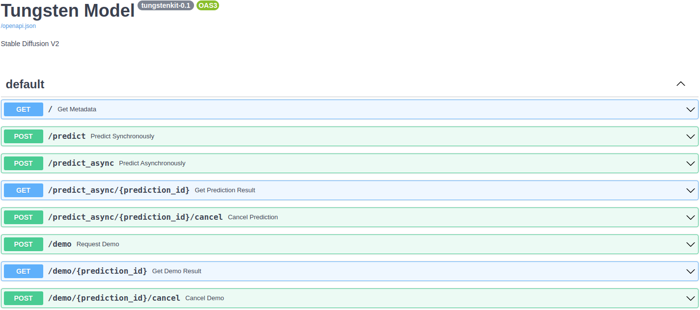

## Installation

The first step is to install Tungstenkit.

The prerequisites are:

- Python 3.7+
- [Docker](https://docs.docker.com/engine/install/)

If they are ready, you can install Tungstenkit as follows:

```shell
pip install tungstenkit
```

## Run an example model
### Create a directory
Let's start by creating a working directory:
```shell
mkdir tungsten-getting-started
cd tungsten-getting-started
```

### Write ``tungsten_model.py``
You can write the ``tungsten_model.py`` file for an image classification model as follows:
```python
from typing import List

import torch
from torchvision import transforms
from torchvision.models.mobilenetv2 import MobileNet_V2_Weights, MobileNetV2
from tungstenkit import io, model


class Input(io.BaseIO):
    image: io.Image


class Output(io.BaseIO):
    score: float
    label: str


@model.config(
    gpu=False,
    description="Image classification model",
    python_packages=["torch", "torchvision"],
    batch_size=16,
)
class Model(model.TungstenModel[Input, Output]):
    def setup(self):
        """Load model weights"""
        self.model = MobileNetV2()
        self.model.load_state_dict(torch.load("mobilenetv2_weights.pth"))
        self.model.eval()

        self.labels = MobileNet_V2_Weights.IMAGENET1K_V2.meta["categories"]
        self.transforms = transforms.Compose(
            [
                transforms.Resize((224, 224)),
                transforms.PILToTensor(),
                transforms.ConvertImageDtype(torch.float),
                transforms.Normalize([0.485, 0.456, 0.406], [0.229, 0.224, 0.225]),
            ]
        )

    def predict(self, inputs: List[Input]) -> List[Output]:
        """Run a batch prediction"""
        print("Preprocessing")
        input_tensor = self._preprocess(inputs)
        print("Inferencing")
        softmax = self.model(input_tensor).softmax(1)
        print("Postprocessing")
        scores, class_indices = torch.max(softmax, 1)
        pred_labels = [self.labels[idx.item()] for idx in class_indices]
        return [
            Output(score=score.item(), label=label) for score, label in zip(scores, pred_labels)
        ]

    def _preprocess(self, inputs: List[Input]):
        pil_images = [inp.image.to_pil_image() for inp in inputs]
        tensors = [self.transforms(img) for img in pil_images]
        input_tensor = torch.stack(tensors, dim=0)
        return input_tensor
```

### Download weights
Before building, you should prepare files used in ``setup`` function of the class. 

As you can see above, ``mobilenetv2_weights.pth`` is required. Let's download it:
```
curl -o mobilenetv2_weights.pth https://download.pytorch.org/models/mobilenet_v2-7ebf99e0.pth
```


### Build a Tungsten model
Now everything is ready. Let's start building a Tungsten model:
```console
$ tungsten build -n tungsten-example

✅ Successfully built tungsten model: 'tungsten-example:e3a5de5616a743fe9021e2dcfe1cd19a' (also tagged as 'tungsten-example:latest')
```
### Show stored models
Tungstenkit saves built and pulled models in a local store.

You can check if the model is stored:

```console
$ tungsten models

Repository        Tag                               Description                 Model Class           Created              Docker Image ID
----------------  --------------------------------  --------------------------  --------------------  -------------------  -----------------
tungsten-example  latest                            Image classification model  tungsten_model:Model  2023-04-26 05:23:58  830eb82f0fcd
tungsten-example  e3a5de5616a743fe9021e2dcfe1cd19a  Image classification model  tungsten_model:Model  2023-04-26 05:23:58  830eb82f0fcd
```


### Run locally
Now, you can run the model in your local machine.

Tungstenkit provides multiple options for that.

#### Option 1: an interactive web demo
```
tungsten demo tungsten-example -p 8080
```
Visit [http://localhost:8080](http://localhost:8080) to check:




#### Option 2: a RESTful API
Start the server:
```console
$ tungsten serve tungsten-example -p 3000

INFO:     Setting up the model
INFO:     Getting inputs from the input queue
INFO:     Starting the prediction service
INFO:     Started server process [1]
INFO:     Waiting for application startup.
INFO:     Application startup complete.
INFO:     Uvicorn running on http://0.0.0.0:3000 (Press CTRL+C to quit)
```

Send a prediction request with a JSON payload:
```console
$ curl -X 'POST' 'http://localhost:3000/predict' \
  -H 'accept: application/json' \
  -H 'Content-Type: application/json' \
  -d '[{"image": "https://picsum.photos/200.jpg"}]'

{
    "outputs": [{"scale": 0.12483298, "label": "web site"}],
}
```


Also, you can find a Swagger documentation in [http://localhost:3000/docs](http://localhost:3000/docs).

<!--  -->

### Run remotely
To do this, you should have an account and an entered project in a Tungsten server running at [https://server.tungsten-ai.com](https://server.tungsten-ai.com).  

If you don't have them, visit [https://webapp.tungsten-ai.com](https://webapp.tungsten-ai.com) in a browser and create them.


First, log in:
```console
$ tungsten login

User (username or email): exampleuser
Password: 
```

Then, push the model:
```console
$ tungsten push exampleuser/exampleproject -n tungsten-example

✅ Successfully pushed 'tungsten-example:latest' to 'https://server.tungsten-ai.com'
  - project: exampleuser/exampleproject
  - version: 98acfab3
```

Now you can find and run it in the Tungsten server.

Visit [https://webapp.tungsten-ai.com](https://webapp.tungsten-ai.com) in a browser to check it.